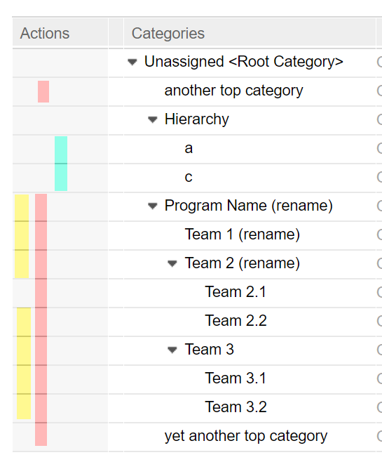

# Category branch visibility restricting Value Set Provider
This plug-in allows to restrict the visibility of certain _RTC Category_ branches based on configured _include_ and _exclude_ filters. The plug-in is implemented as a **Value Set Provider**. 

## About Value Set Providers
_Value Set Provider_ allow you to limit the options provided to the user based on certain criterias that you may define. They always return a subset of the original amount of data or provide a custom selection of data, rather than providing nothing, depending on the context of the provider.

There is an excellent article - [Attribute Customization – Java Based Value Providers, Conditions and Validators](https://rsjazz.wordpress.com/2013/06/26/attribute-customization-java-based-value-providers-conditions-and-validators/) - written by [@rsjazz](https://github.com/rsjazz) which explains in great detail the diffrent ways that RTC offers to customize attribute behavior. The section _"Value Set Provider"_ gives an example on how to implement such a provider. This repository is an easy ready-to-use implementation of a _Value Set Provider_.

## Restricting Categories
This provider allows to restrict any attribute of type **category**, whereas _Filed Against_ is the most famous and common instance of this type.

## Usage Examples
To get an idea what can be done with this plug-in, have a look at the following category tree. The colored bars are used in the examples below to show how to select the marked elements.

 

### Red
Use all except of the excluded branch - _"Hierarchy"_.

```xml
<valueSetProvider
        id="exclude-hierarchy"
        ame="Restrict Category Value Provider"
        providerId="org.jazzcommunity.attributeValueProviders.restrictCategory.RestrictCategoryValueProvider"
>
    <exclude categoryPath="Hierarchy"/>
</valueSetProvider>
```

### Cyan
Include all immediate children and all their branches of a certain branch.

```xml
<valueSetProvider 
        id="only-hierarchy-children"
        name="Restrict Category Value Provider"
        providerId="org.jazzcommunity.attributeValueProviders.restrictCategory.RestrictCategoryValueProvider"
>
    <include categoryPath="Hierarchy" childOnly="true" />
</valueSetProvider>
```

### Yellow
Include a certain branch - _"Program Name (rename)_ - and exclude one of it's child branches - _"Team 2.1"_.

```xml
<valueSetProvider 
        id="one-root-with-excluded-child-branch"
        name="Restrict Category Value Provider"
        providerId="org.jazzcommunity.attributeValueProviders.restrictCategory.RestrictCategoryValueProvider"
>
    <include categoryPath="Program Name (rename)" />
    <exclude categoryPath="Program Name (rename)/Team 2 (rename)/Team 2.1" />
</valueSetProvider>
```

## Configuration
The following changes to the process template of your choice are necessary to enable the _Value Set Provider. 

In the section `<valueSetProviders>`, add a new section`<valueSetProvider>`, like the one below:

```xml
<valueSetProviders>
    ...
    <valueSetProvider
            id="hierarchy-attribute-show-children-only" 
            name="Restrict Category Value Provider" 
            providerId="org.jazzcommunity.attributeValueProviders.restrictCategory.RestrictCategoryValueProvider"
    >
        <include categoryPath="Hierarchy" childOnly="true" />
    </valueSetProvider>
    ...
</valueSetProviders>
```

The value of the _id_ above - `id="hierarchy-attribute-show-children-only"` - can be any kind of unique string. It will be reference from and must match with `providerId`, as shown in the example below.

In the section `<attributeDefinitions>`, look for the repective `<attributeDefinition>` section and add the `<valueSetProvider>` section as a new child section, e.g. like the one below:

```xml
<attributeDefinitions>
    ...
    <attributeDefinition
            id="com.ibm.team.workitem.attribute.category"
            name="Filed Against"
            type="category"
    >
        ...
        <dependsOn id="projectArea"/>
        ...
        <valueSetProvider providerId="filed-against-without-hierarchy"/>
        ...
    </attributeDefinition>
  ...
</attributeDefinitions>
```

## Installation
The most convenient way to install this service is to download the current stable release from the [Releases](../../releases) page.
If you don't already know how, head over to the [RTC Git Connector](https://github.com/jazz-community/rtc-git-connector) page to learn how to install RTC plug-ins (it's always the same procedure).

## Contributing
Please use the [Issue Tracker](../../issues) of this repository to report issues or suggest enhancements.

For general contribution guidelines, please refer to [CONTRIBUTING.md](https://github.com/jazz-community/welcome/blob/master/CONTRIBUTING.md)

## Licensing
Copyright (c) Jazz Community. All rights reserved.<br>
Licensed under the [MIT](./LICENSE) License.
